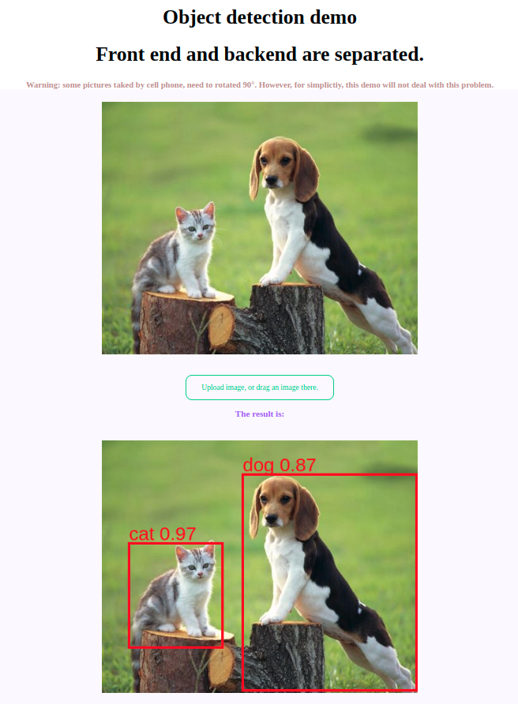
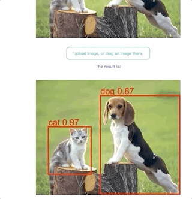
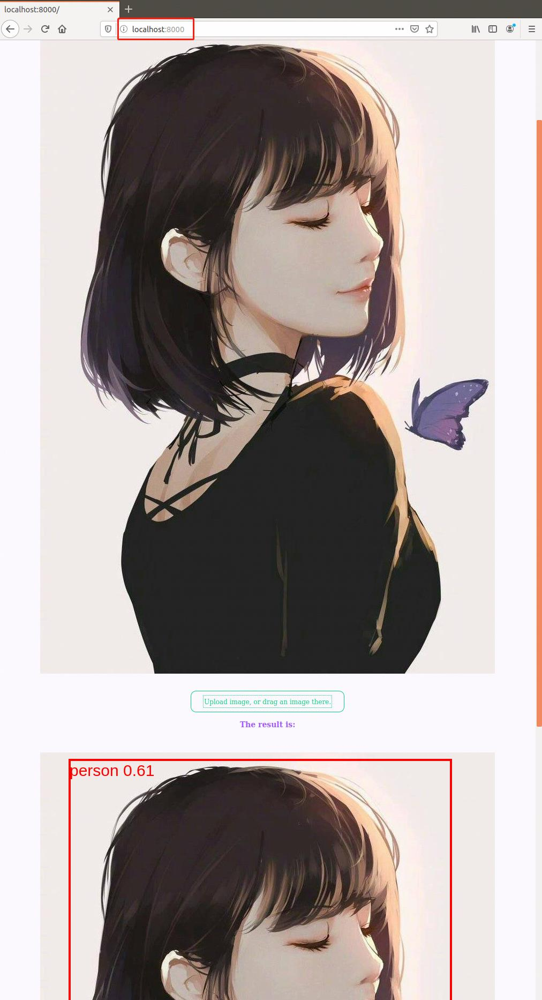

# Flask with tensorflow object detection demo

- Frontend and backend are separated, not with common flask template. 

If you are chinese, you can read one Chinese blog about this repo here.
[几十行代码构建一个前后端分离的目标检测演示网站，代码开源](https://mp.weixin.qq.com/s/MIBNjqfx0yG-Bdq2OaeOuA)


## Server part

Since flask is very simple and wroted by python, we build it with only a few lines of code.

This function receive base64 encoded image from front end page, converted it to PIL Image, then do the object detection step.

```
@app.route('/api/', methods=["POST"])
def main_interface():
    response = request.get_json()
    data_str = response['image']
    point = data_str.find(',')
    base64_str = data_str[point:]  # remove unused part like this: "data:image/jpeg;base64,"

    image = base64.b64decode(base64_str)       
    img = Image.open(io.BytesIO(image))

    if(img.mode!='RGB'):
        img = img.convert("RGB")
    
    # convert to numpy array.
    img_arr = np.array(img)

    # do object detection in inference function.
    results = inference(sess, detection_graph, img_arr, conf_thresh=0.5)
    print(results)

    return jsonify(results)
```

## Front end part
In front end page, with the help of  jQuery ajax, we can send the base64 image to backend, wait for the result, then draw the bounding box on the page.

Core code is:
```
// handle image files uploaded by user, send it to server, then draw the result.
function parseFiles(files) {
  const file = files[0];
  const imageType = /image.*/;
  if (file.type.match(imageType)) {
    warning.innerHTML = '';
    const reader = new FileReader();
    reader.readAsDataURL(file);
    reader.onloadend = () => {
      image.src = reader.result;
      // send the img to server
      communicate(reader.result);
    }
  } else {
    setup();
    warning.innerHTML = 'Please drop an image file.';
  }
}
```

## How to run.
Step 1: Open the server with 
```
python app.py

```
The server is setup on port 5000.

Step 2: Open the front end page.

If you want to use python.
```
// python3
python -m http.server
// python2
python -m SimpleHTTPServer

```
If you prefer Node.js
```
npm install serve -g // install serve
serve // this will open a mini web serve
// or http-serve
npm install http-server -g
http-server
```

## Demo
You can click the button, or drag one image to the page, then the result will show bellow.



## Run by Docker

### Quick Start：

If you have docker installed, you can quickly test demo:

`docker run -p 5000:5000 -p 8000:8000 -d vicwoo/flask-object-detection:1.0`

### Docker Build：

If you want to build your own docker image, you can modify the Dockerfile and execute the command:

`docker build -t flask-object-detection:1.0 .`

`docker run -p 5000:5000 -p 8000:8000 -d flask-object-detection:1.0`

### Demo Results:


